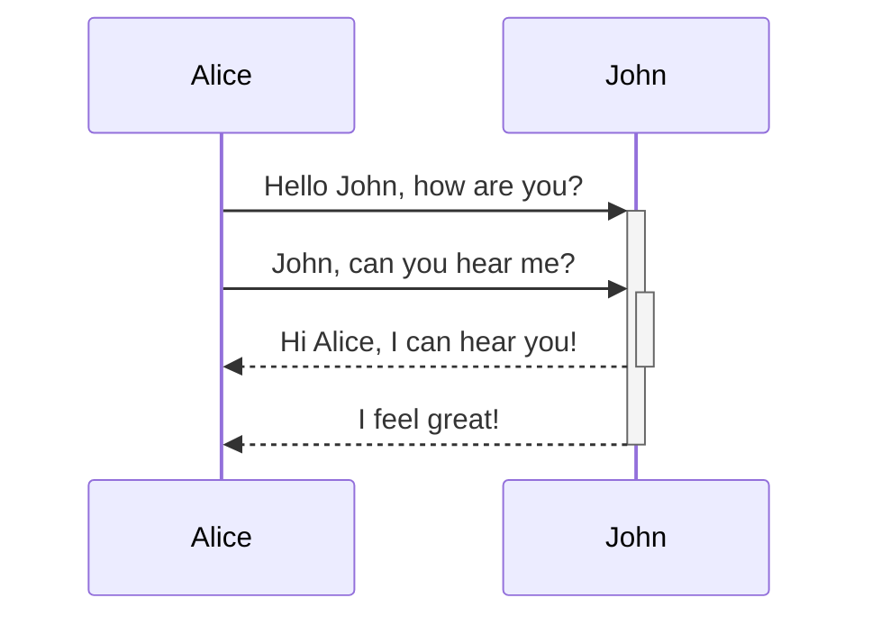

# Graph

# Sequence

# Resources
- [GitHub Blog markdown with mermaid](https://github.blog/2022-02-14-include-diagrams-markdown-files-mermaid/)
- [Mermaid](https://mermaid-js.github.io/mermaid/#/)
- [Mermaid Cheat Sheet](https://jojozhuang.github.io/tutorial/mermaid-cheat-sheet/)
